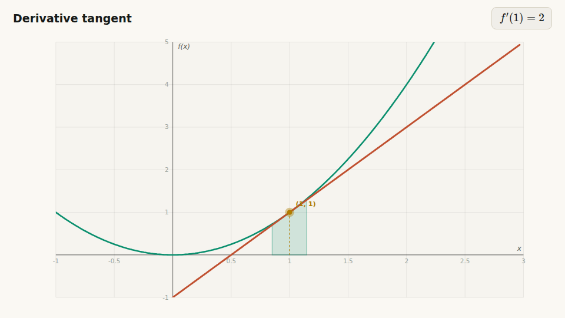
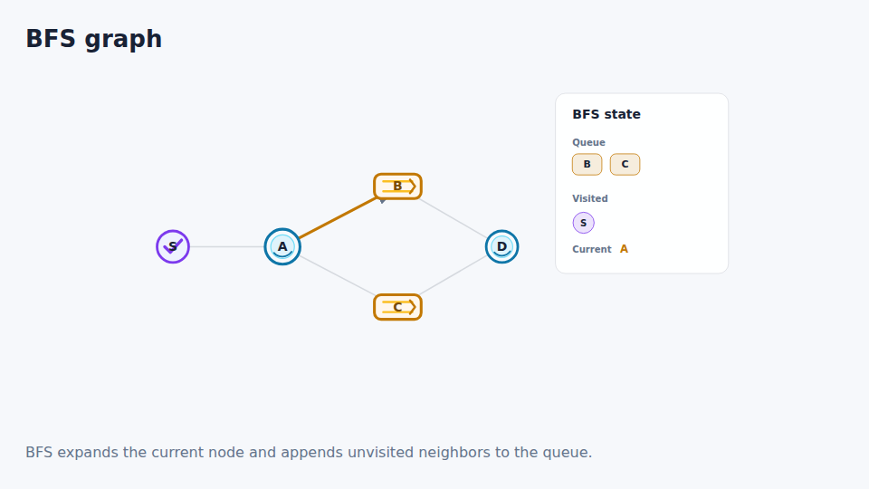
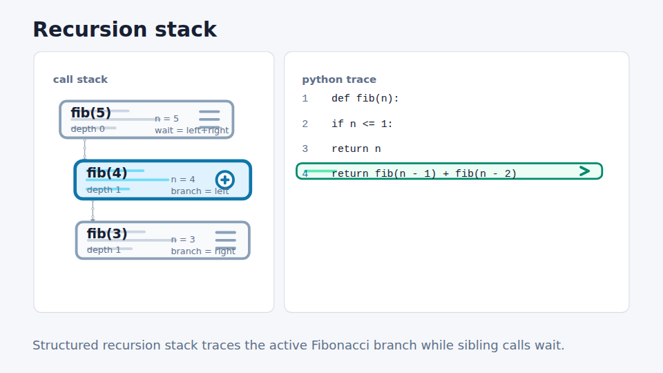

# MetaView

> 把一道题，变成一段看得见、可以操作、可以继续追问的理解过程。

MetaView 是一个面向教育场景的 AI 可视化讲解平台。它把题目、知识点或代码转成可播放、可逐步控制、可继续追问和修改的教学讲解，而不只是生成一组幻灯片或一段静态视频。

核心产物是两份独立契约：

- `PlaybookScript`：教学步骤、画面状态、公式、代码轨道、旁白和可调参数。
- `DirectorScript`：镜头、节奏、焦点、强调词和观看顺序。

二者最终统一进入 Remotion 播放器和导出链路。项目不使用 Manim、HTML iframe 或服务端 HTML 录屏作为另一套渲染出口。

开发入口请先读 [`docs/START_HERE.md`](docs/START_HERE.md)。

## 产品能力

| 环节 | 能力 |
|---|---|
| 输入 | 输入题目或知识点、粘贴代码、上传一个不超过 256 KB 的受支持代码文件 |
| 理解与规划 | 后端路由学科与主题，生成 `CoverageDecision` 和 renderer-independent `LessonPlan` |
| 生成 | deterministic SkillPack、受控组合、Agent runtime 或 legacy single 路径生成 `PlaybookScript` |
| 播放 | Remotion 帧驱动播放、逐步跳转、播放速度、字幕、TTS、桌面与移动竖屏布局 |
| 参数互动 | 数学参数滑块；五种排序算法可修改输入数组并确定性重放 |
| Code Sync | 代码语法高亮、当前行/操作标签、变量监视，并随教学步骤同步 |
| Follow-up | 围绕当前讲解继续问；可只回答，也可安全修改 Playbook；修改版本可回看和恢复 |
| 质量控制 | Agent 轻量自检、后端 canonical `QualityReport`、资产审计、视觉基线和 Benchmark V2 |
| 导出 | 与播放器共用渲染器的 Remotion 视频导出；无音轨导出为稳定路径 |

支持七个教学领域：`algorithm`、`math`、`code`、`physics`、`chemistry`、`biology`、`geography`。这表示管线和专用渲染能力覆盖这些领域，并不表示其中任意题目都达到同一质量等级；实际请求会由 CoverageResolver 判定为 `specialized`、`composable`、`experimental` 或 `unsupported`。

## 真实渲染结果

以下画面来自仓库 Visual Check 实际生成的 Remotion/renderer 帧，不是设计稿或概念图。

| 导数与切线 | BFS 遍历 |
|---|---|
|  |  |

递归调用栈与代码轨道：



## 交互式学习工作台

MetaView 不是纯线性视频播放器。参数面板、Code Sync 和 Follow-up 构成三条协同的交互轨道：参数面板改变确定性状态，Code Sync 解释执行过程，Follow-up 负责教学问答或对讲解版本做受控修改。

| 模块 | 能力 | 边界 |
|---|---|---|
| 步进控制 | 按步骤前进、后退或直接跳转 | 桌面与移动布局共用同一时间线 |
| 数学参数面板 | 读取 `PlaybookScript.parameter_controls`，通过滑块或数字输入实时覆盖参数 | 参数变化只影响受控字段 |
| 算法参数面板 | 修改输入数组并确定性重放排序过程 | 支持 `merge_sort`、`bubble_sort`、`quick_sort`、`selection_sort`、`insertion_sort` |
| Code Sync | 同步显示代码、活动行、操作标签和变量变化 | 支持 JS/TS、Python、Java、Go、C/C++、Rust |
| Follow-up | 返回解释，或对 Playbook 生成受约束修改 | 修改必须通过质量门 |
| 版本记录 | 保存 initial / follow-up / restore 版本并恢复历史状态 | 恢复时同步 Playbook 与 Director |

## Follow-up 不是普通聊天框

工作台右侧的 Follow-up 模块以当前 Playbook 为上下文：

1. 概念性追问可以只返回解释，不改变视频。
2. “增加一步”“换一种讲法”“调整画面或参数”等请求可以生成 RFC 6902 子集 patch。
3. 可修改路径限制在标题、摘要、步骤、参数、算法 ID 和初始数据，不能直接改写 FPS 或时间线终点。
4. 修改后的 Playbook 会重新规范化时间线并进入 canonical quality gate。
5. 只有通过质量门的修改才会保存为新版本；同时重新构建并保存 DirectorScript。
6. 版本记录显示 initial / follow-up / restore、短 ID、摘要和 HEAD，可切换回历史版本。

相关实现：

- `apps/api/app/application/use_cases/follow_up.py`
- `apps/api/app/presentation/router_runs.py`
- `apps/web/src/features/followups/`
- `apps/web/src/pages/Studio/StudioPage.tsx`

## Code Sync 与代码高亮

代码不是静态贴在画面旁边。`CodeHighlightOverlay` 与视觉 snapshot 并行，并在工作台中随步骤更新：

- 语法 tokenizer 覆盖关键字、字符串、数字、注释和操作符；支持跨行 `/* ... */` 注释。
- 当前执行行、相关行和操作标签会高亮。
- 变量监视区显示当前状态，并对值变化给出视觉反馈。
- BFS、递归调用栈和 `code_trace_scene` 可以从结构化状态构造 Code Sync 轨道。
- Code Sync 保留在学习控制台中；默认不烧录进主舞台或导出视频，避免遮挡教学画面。

相关实现：

- `apps/web/src/features/playbook/engine/renderers/CodeHighlightRenderer.tsx`
- `apps/web/src/features/playbook/engine/renderers/codeTokenizer.ts`
- `apps/web/src/features/playbook/engine/player/resolveCodePanelOverlay.ts`

## 生成与导演管线

```text
User input
  -> subject router
  -> CoverageDecision
  -> LessonPlan
  -> SkillPack / SkillRecipe / Agent / legacy CIR
  -> PlaybookScript
  -> canonical QualityReport
  -> DirectorScript
  -> RenderPlan
  -> Remotion preview / export
```

- `CoverageDecision` 决定能力边界、回退或拒绝策略。
- `LessonPlan` 只表达教学目标、误区、结论、教学弧线和 SceneIntent，不包含帧、坐标或 renderer 私有字段。
- `PlaybookScript` 是唯一内容渲染契约。
- `DirectorScript` 独立负责 shot、camera motion、pacing、focus target 和 emphasis。
- `RenderPlan` 将导演意图适配为 Remotion 可消费的 scale、translate、opacity 和 timing。

### 两种生成模式

| 模式 | 工作方式 | 适用场景 |
|---|---|---|
| `single` | LLM 生成 CIR + ExecutionMap，再构建 Playbook | 直接、可回滚的生成链路 |
| `agent` | Agent 调用 RuntimeToolHub、动画工具和绘图工具生成 Playbook | 需要工具编排和确定性能力组合的内容 |

Agent runtime 可以列出和执行 deterministic SkillPack、SceneBlueprint compiler、schema/self-check、几何断言和动画工具；但 Agent 的自检只是前置检查，最终成功语义仍由 API 后端的 `QualityReport` 决定。

## 质量门、Benchmark 与资产治理

### Canonical QualityReport

SkillPack、Agent 和 single 三条路径在写入 `succeeded` 前都会运行 `quality_gate_playbook(...)`：

```text
candidate PlaybookScript
  -> clean / warnings: 保存 DirectorScript 并成功
  -> repairable: 执行一次与生成路径匹配的修复
  -> blocked 或修复失败: fail closed
```

检查覆盖空步骤、无效时间线、旁白与 payload、renderer contract、缺失资产、学科错误降级、数学/算法/递归/抛体的最低语义状态、Code Sync 一致性、LessonPlan 事实与最终结论。Follow-up 修改、版本恢复和导出都会重新检查当前 Playbook。

### Benchmark V2

四个 Gold Case 是：

- 导数与切线：`math-derivative-tangent`
- BFS：`algorithm-bfs-tree`
- 递归阶乘：`code-recursion-factorial`
- 平抛运动：`physics-projectile`

评分包含契约、知识正确性、教学结构、视觉覆盖、Code Sync、旁白一致性和导出就绪度。总分达到 90 仍不够：任一 hard-fail 都会让该次尝试失败。

```bash
make eval-gold
make eval-gold LIVE=1 API=http://localhost:8000 REPEAT=3
```

Checked-in fixtures 用于回归和迁移验证，不作为发布质量证据。发布验收应基于真实生成的独立重复运行和 `eval/reports/` 证据。

### 资产与 showcase

资产系统包含 manifest schema、registry、license registry、路径审计、导出归因报告和 preflight。`make visual-check` 会执行：

- 资产 manifest / 文件 / 许可证审计；
- 结构化学科 showcase 的静态渲染 smoke；
- 图片基线、漂移检查和 review packet 生成。

内部 showcase 已覆盖地理季风、抛体运动、细胞/DNA、分子/化学反应、导数曲线、BFS、递归和代码追踪等结构化 fixture。它们是渲染器与资产质量证据，不等于已经发布给教师的公共成品案例。

## 模板与内部 Showcase

| 类型 | 用途 |
|---|---|
| `/templates` | 搜索和筛选 prompt 起点，点击后发起新的生成 |
| `/asset-showcase` 与 fixture matrix | 验证 renderer、SceneBlueprint、资产包和视觉基线 |

模板是生成起点；showcase fixture 是渲染器和资产的回归证据。两者都不应被当作真实生成质量的替代证明。

## Edition 与访问边界

前后端 edition 必须一致：`METAVIEW_APP_EDITION` 与 `VITE_APP_EDITION` 都设为 `self` 或都设为 `ops`。

| 能力 | `self` | `ops` |
|---|---|---|
| 公共 Landing `/` | 可访问 | 可访问 |
| 应用工作台 | 无账户体系 | 微信登录后访问 |
| 模型来源 | 浏览器本地保存的 OpenAI 兼容 BYOK；也可使用服务端配置/mock | 平台托管模型 |
| 客户端 Provider override | 允许 | 拒绝 |
| 余额/充值/账户 | 不显示 | 登录后启用 |
| 运行历史 | 本地 SQLite | 按微信账户隔离 |
| 管理后台 | 不可用 | `/admin`，仍需 `role=admin` |

## 快速开始

需要 Node.js、Python 和 `make`。推荐先使用默认 `self + single + mock` 配置确认完整管线。

```bash
make bootstrap
make setup-hooks
cp .env.example .env
make dev
```

默认本地地址：

| 服务 | 地址 |
|---|---|
| API | `http://localhost:8000` |
| Web | `http://localhost:5173` |
| Agent sidecar | `http://localhost:8001` |

也可以拆开运行：

```bash
make dev-api
make dev-web
make dev-agent
```

Docker：

```bash
cp .env.example .env
make start
make stop
```

自用版与运营版也可以通过启动脚本进入：

```bash
./start.sh
./start.sh op
```

## 常用验证命令

| 命令 | 内容 |
|---|---|
| `make lint` | Ruff + ESLint 等静态检查 |
| `make test` | API / Web / Agent / MCP 测试 |
| `make build` | 前后端及相关构建检查 |
| `make check` | `lint + test + build` 默认门禁 |
| `make test-coverage` | 覆盖率检查 |
| `make visual-check` | 资产审计 + showcase 重型视觉检查 |
| `make eval-gold` | Benchmark V2 四个 Gold Case |

生成的 `eval/reports/`、`eval/videos/` 和 `eval/shots/` 是本地证据，不应提交。

## 关键配置

完整变量见 [`.env.example`](.env.example)。常用项：

| 变量 | 说明 |
|---|---|
| `METAVIEW_APP_EDITION` / `VITE_APP_EDITION` | `self` 或 `ops`，必须一致 |
| `METAVIEW_GENERATION_MODE` | `single` 或 `agent` |
| `METAVIEW_MOCK_PROVIDER_ENABLED` | 未配置真实模型时是否允许 mock |
| `METAVIEW_OPENAI_API_KEY` | 服务端 OpenAI 兼容 provider key |
| `METAVIEW_OPENAI_BASE_URL` / `METAVIEW_OPENAI_MODEL` | 服务端兼容接口和模型 |
| `METAVIEW_AGENT_PROVIDER` | Agent adapter：`http` 或 `codex` fallback |
| `METAVIEW_AGENT_BASE_URL` / `METAVIEW_AGENT_SHARED_TOKEN` | Agent sidecar 地址和共享鉴权 token |
| `METAVIEW_ROUTER_MODE` | `off` / `heuristic` / `llm` / `hybrid` |
| `METAVIEW_HISTORY_DB_PATH` | 本地 SQLite 路径 |
| `METAVIEW_PLAYBOOK_DEFAULT_FPS` | 默认帧率 |

生产环境必须为登录、支付回调和下载地址配置公网 HTTPS，并关闭不适合生产的 mock/dev 选项。

## API 概览

| Method | Path | 说明 |
|---|---|---|
| `POST` | `/api/v1/pipeline` | 创建生成任务 |
| `GET` | `/api/v1/runs` | 运行历史 |
| `GET` | `/api/v1/runs/{run_id}` | 读取运行结果、Coverage、LessonPlan、Playbook、QualityReport 与 Director |
| `POST` | `/api/v1/runs/{run_id}/follow-up` | 追问或提交受控修改 |
| `GET` | `/api/v1/runs/{run_id}/follow-ups` | 追问与版本记录 |
| `POST` | `/api/v1/runs/{run_id}/versions/{version_id}/restore` | 恢复历史版本 |
| `POST` | `/api/v1/exports` | 创建视频导出任务 |
| `GET` | `/api/v1/exports/{job_id}` | 查询导出状态 |
| `GET` | `/api/v1/exports/{job_id}/download` | 下载导出文件 |
| `GET` | `/health` | 健康检查 |

## 目录结构

| 路径 | 内容 |
|---|---|
| `apps/api` | FastAPI：生成管线、质量门、运行/版本持久化、账户、支付和导出 |
| `apps/web` | React 19 + Vite + Remotion：工作台、播放器、Code Sync、参数面板和 Follow-up |
| `apps/agent` | Agent sidecar：Drawing CLI、runtime/animation tools 和 Agent self-check |
| `skills` | 学科 SkillPack / agent prompt reference |
| `docs` | 架构、契约、质量门、Benchmark、资产和验收文档 |
| `eval` | Benchmark 配置、Gold Case 与本地评测入口 |
| `data` | 本地 SQLite、导出文件和调试数据 |

后端遵循 Clean Architecture；前端采用 Feature-Sliced Design。新增 snapshot renderer 时必须同时更新后端判别联合、前端类型、renderer registry、质量契约和跨运行时一致性测试。

## 已知边界

- 首发附件只支持文本和代码文件；图片、截图、PDF、PPT/课件和任意附件尚不支持生成。
- Agent mode 需要按 [`docs/agent-demo-acceptance.md`](docs/agent-demo-acceptance.md) 独立验收。
- CoverageResolver 只对受控 profile 提供专用或可组合能力，无法可靠覆盖的请求会降级或拒绝。
- 学习工作台围绕步进、参数、Code Sync 和 Follow-up 设计，不是通用自由画布编辑器。
- 有音轨视频导出仍为 beta；无法保证音频时序时应使用稳定的 silent export。
- 化学分子路径在生产部署中依赖 RDKit；部署前应确认依赖和隔离策略。

## 文档索引

- [`docs/START_HERE.md`](docs/START_HERE.md) — 当前主线与阅读顺序
- [`docs/pipeline.md`](docs/pipeline.md) — 生成、Code Sync、Playbook、Director 和导出
- [`docs/director-layer.md`](docs/director-layer.md) — 独立导演层
- [`docs/lesson-plan.md`](docs/lesson-plan.md) — 教学规划契约
- [`docs/coverage-and-fallback.md`](docs/coverage-and-fallback.md) — 能力判定与回退边界
- [`docs/quality-gate.md`](docs/quality-gate.md) — canonical QualityReport
- [`docs/benchmark-v2.md`](docs/benchmark-v2.md) — Gold Case 评分和 hard-fail
- [`docs/assets.md`](docs/assets.md) — 资产包、showcase、审计和归因
- [`docs/frontend-shell.md`](docs/frontend-shell.md) — 路由、工作台与 edition shell
- [`docs/agent-demo-acceptance.md`](docs/agent-demo-acceptance.md) — Agent runtime 验收
- [`CONTRIBUTING.md`](CONTRIBUTING.md) — 开发和提交约定
