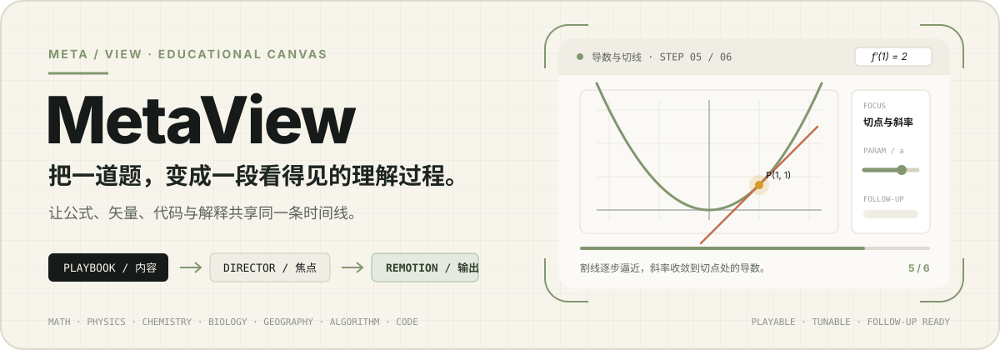
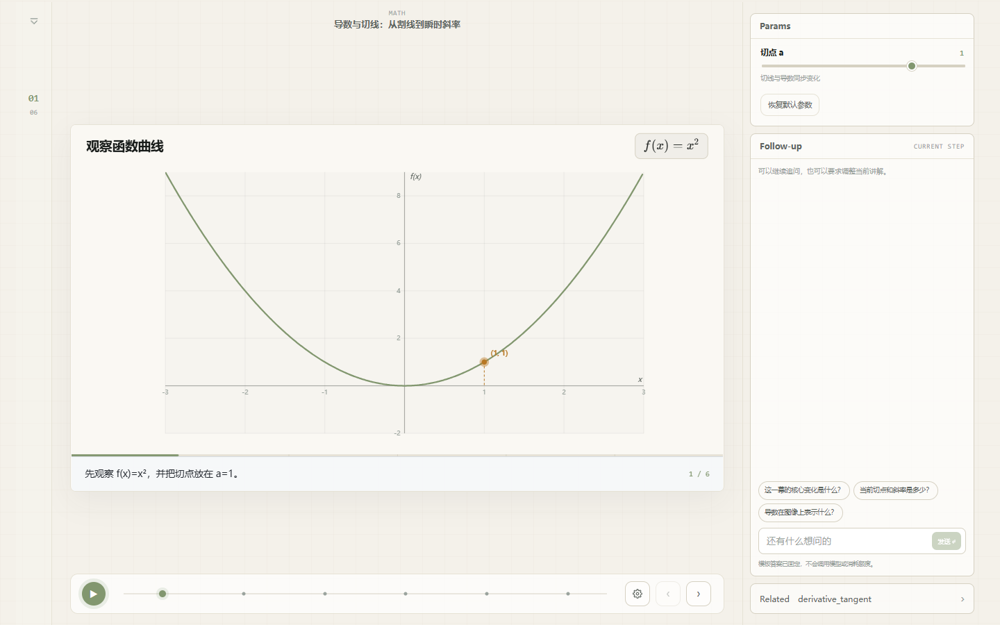
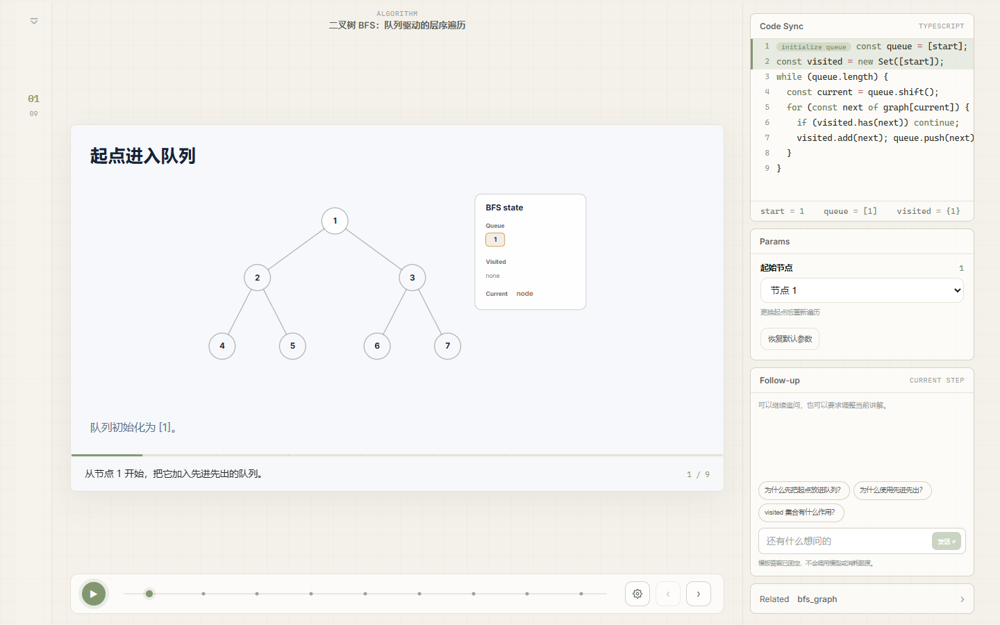
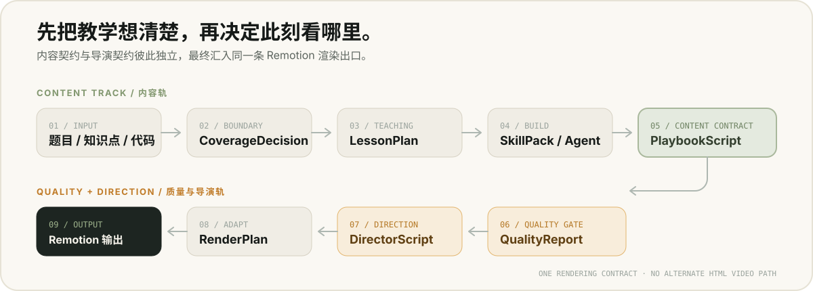

<p align="center">
  
</p>

<p align="center">
  <a href="#先看它做出来的讲解">真实案例</a> ·
  <a href="#它不只生成一段视频">产品能力</a> ·
  <a href="#从输入到可播放的理解">工作原理</a> ·
  <a href="#核心代码导航">核心代码</a> ·
  <a href="#快速开始">快速开始</a> ·
  <a href="#能力边界">能力边界</a> ·
  <a href="./docs/START_HERE.md">开发入口</a>
</p>

MetaView 是一个面向教育场景的 AI 可视化讲解系统。输入一道题、一个知识点或一段代码，它会生成一份可以逐步播放、调整参数、同步查看代码、继续追问和安全修改的讲解，而不只是把文字排进幻灯片或导出一段静态视频。

核心只有一条渲染出口：教学内容由 `PlaybookScript` 描述，镜头、节奏与焦点由 `DirectorScript` 描述，二者最终进入同一套 Remotion 播放与导出链路。

## 先看它做出来的讲解

下面两张图由当前应用实际运行后截取，不沿用旧版 Logo、已退役教学素材或历史封面。案例可以在 `/templates` 进入共享的 `PlaybookPlayer`，切换步骤、调整参数并查看固定 Follow-up；这条静态路径不会创建任务、调用 LLM 或扣减额度。

### 导数与切线：画面、参数与当前步骤在一起

<p align="center">
  
</p>

从函数曲线出发，逐步进入割线、切点与切线斜率；参数面板改变切点，步骤时间线和讲解画面随之更新。

### BFS：视觉状态与 Code Sync 共享时间线

<p align="center">
  
</p>

当前节点、队列、访问集合、活动边和代码行保持同步，让“先进先出”从一句定义变成可以逐步检查的执行过程。

当前正式模板还包括二分查找和平抛运动；README 暂不使用仍在迁移或视觉质量不足的旧素材。仓库中的其他 fixture 主要用于渲染回归与视觉验收，不等同于已经发布给学习者的成品案例。

## 它不只生成一段视频

MetaView 的学习工作台围绕同一份 Playbook 提供四条协同轨道：

| 轨道 | 你可以做什么 | 系统如何守住边界 |
|---|---|---|
| 分步播放 | 前进、后退、跳转步骤、调节速度、查看字幕 | 桌面与移动布局共用同一时间线 |
| 参数互动 | 调整数学参数；修改排序算法的输入数组并确定性重放 | 只覆盖 Playbook 中声明的受控字段 |
| Code Sync | 同步查看活动代码行、操作标签和变量变化 | 代码轨道默认保留在学习控制台，不遮挡主舞台与导出画面 |
| Follow-up | 围绕当前步骤继续问，或要求增加一步、换种讲法、调整画面 | 修改使用受限 patch，通过质量门后才保存为可恢复的新版本 |

### Follow-up 不是普通聊天框

Follow-up 会带着原题、当前步骤和画布上下文继续工作：

1. 概念性追问可以只返回解释，不改变当前讲解。
2. “增加一步”“讲慢一点”“调整参数”等请求可以生成受约束修改。
3. 修改后的 Playbook 会重新规范化时间线并进入 canonical quality gate。
4. 只有通过质量门的结果才会成为新版本；恢复历史版本时，Playbook 与 Director 会一起恢复。

可修改范围限定在标题、摘要、步骤、参数、算法 ID 和初始数据等教学内容，不能直接改写 FPS 或时间线终点。

## 从输入到可播放的理解

<p align="center">
  
</p>

### 两份独立契约

- `PlaybookScript` 是唯一的内容渲染契约，负责教学步骤、画面状态、公式、视觉对象、代码轨道、旁白和可调参数。
- `DirectorScript` 是独立的导演契约，负责 shot、camera motion、pacing、focus target、强调词与可选的导演旁白覆盖。

`LessonPlan` 只表达教学目标、误区、结论、教学弧线和 `SceneIntent`，不携带帧、坐标或 renderer 私有字段。`RenderPlan` 再把导演意图适配为 Remotion 可消费的缩放、位移、透明度和 timing。

项目不使用 Manim、HTML iframe 或服务端 HTML 录屏作为另一套输出路径。

### 两种生成模式

| 模式 | 工作方式 | 适合什么情况 |
|---|---|---|
| `single` | LLM 生成 CIR + ExecutionMap，再构建 Playbook | 默认、直接、可回滚的生成链路 |
| `agent` | Agent 调用 RuntimeToolHub、动画工具和 deterministic SkillPack | 需要工具编排与确定性能力组合的内容 |

Agent 自检只是前置检查。无论内容来自 SkillPack、Agent 还是 single 路径，最终成功语义都由 API 后端的 canonical `QualityReport` 决定。

## 核心代码导航

### 生成契约

**核心文件：** [`playbook.py`](./apps/api/app/domain/models/playbook.py) · [`playbook_contract.py`](./apps/api/app/domain/contracts/playbook_contract.py) · [`types.ts`](./apps/web/src/features/playbook/engine/types.ts)

- **解决了什么问题：** 让生成端、API 和播放器对“什么是可渲染讲解”使用同一份 `PlaybookScript` 结构。
- **为什么这样设计：** 后端负责验证权威契约，前端保留对应的判别联合；生成方式可以变化，渲染出口不变。
- **你能现场讲解什么：** 从一种 snapshot 的后端模型出发，对照前端类型，看它如何进入播放器。

### Quality Gate

**核心文件：** [`playbook_quality.py`](./apps/api/app/domain/services/playbook_quality.py) · [`quality_report.py`](./apps/api/app/domain/models/quality_report.py) · [`test_playbook_review_self_check.py`](./apps/api/tests/test_playbook_review_self_check.py)

- **解决了什么问题：** 阻止“结构合法但内容错误、画面不可用”的 Playbook 被标记为成功。
- **为什么这样设计：** API 是最终裁决者，统一输出 `clean / warnings / repairable / blocked`，避免各端各自定义成功。
- **你能现场讲解什么：** 给候选 Playbook 制造一个时间线或语义错误，看质量门如何定位、尝试修复或 fail closed。

### Follow-up

**核心文件：** [`router_runs.py`](./apps/api/app/presentation/router_runs.py) · [`follow_up.py`](./apps/api/app/application/use_cases/follow_up.py) · [`sqlite_run_repository.py`](./apps/api/app/infrastructure/persistence/sqlite_run_repository.py)

- **解决了什么问题：** 用户可以继续追问或安全修改已有讲解，而不必整份重新生成。
- **为什么这样设计：** 修改被限制为白名单 patch，并在重新通过质量门后保存为可恢复版本；解释型追问可以不改 Playbook。
- **你能现场讲解什么：** 从一条 Follow-up 请求追到 patch 校验、版本写入，再恢复到历史版本。

### Interaction Engine

**核心文件：** [`engine.ts`](./apps/web/src/features/playbook/interaction/engine.ts) · [`useInteractionSandbox.ts`](./apps/web/src/features/playbook/interaction/useInteractionSandbox.ts) · [`followUpContext.ts`](./apps/web/src/features/playbook/interaction/followUpContext.ts)

- **解决了什么问题：** 让切点、BFS 起点等参数可以即时重算画面，同时不污染已保存的 Playbook。
- **为什么这样设计：** 交互目标先由 manifest 明确声明，再在浏览器沙箱中确定性重放；只有用户确认后才进入持久化流程。
- **你能现场讲解什么：** 改变导数切点或 BFS 起点，看事件如何生成新状态，并把当前交互上下文交给 Follow-up。

### Benchmark

**核心文件：** [`gold_cases.json`](./eval/benchmark_v2/gold_cases.json) · [`benchmark_v2.py`](./apps/api/eval/benchmark_v2.py) · [`runner.py`](./apps/api/eval/runner.py) · [`test_benchmark_v2_gold_cases.py`](./apps/api/tests/test_benchmark_v2_gold_cases.py)

- **解决了什么问题：** 区分“能生成”与“知识、教学、视觉和 Code Sync 都达到产品要求”。
- **为什么这样设计：** Gold Case 把期望声明成数据，评分器检查语义状态与 hard-fail，运行器支持独立重复运行，避免只为单个 fixture 调分。
- **你能现场讲解什么：** 运行一个 Gold Case，逐项查看七维评分、hard-fail 和多次运行的稳定性报告。

## 支持范围

当前管线和专用渲染能力覆盖七个教学领域：

`algorithm` · `math` · `code` · `physics` · `chemistry` · `biology` · `geography`

覆盖一个领域不代表其中任意题目都达到同一质量等级。每次请求都会由 CoverageResolver 判定：

| 判定 | 含义 |
|---|---|
| `specialized` | 有明确的专用能力与渲染路径 |
| `composable` | 可以由受控能力组合完成 |
| `experimental` | 可以尝试，但需要更严格地验证结果 |
| `unsupported` | 无法可靠覆盖，系统应降级或拒绝 |

## 快速开始

需要 Node.js、Python 和 `make`。第一次运行推荐使用 `self + single + mock`，先确认不依赖真实模型凭据的完整管线。

```bash
make bootstrap
make setup-hooks
cp .env.example .env
make dev
```

默认本地地址：

| 服务 | 地址 |
|---|---|
| Web | `http://localhost:5173` |
| API | `http://localhost:8000` |
| Agent sidecar | `http://localhost:8001` |

打开 `/templates` 可以先体验四个静态正式案例；打开 `/create` 进入讲解创建工作台。根路径 `/` 是产品 Landing，不是生成器入口。

也可以拆开启动：

```bash
make dev-api
make dev-web
make dev-agent
```

Docker：

```bash
cp .env.example .env
make start
make stop
```

自用版与运营版也可以通过启动脚本进入：

```bash
./start.sh
./start.sh op
```

## Edition 与模型来源

前后端 edition 必须一致：`METAVIEW_APP_EDITION` 与 `VITE_APP_EDITION` 都设置为 `self` 或都设置为 `ops`。

| 能力 | `self` | `ops` |
|---|---|---|
| 公共 Landing `/` | 可访问 | 可访问 |
| 应用工作台 | 无账户体系 | 游客可填写草稿；提交、历史和已有运行需要微信登录 |
| 模型来源 | 浏览器本地保存的 OpenAI 兼容 BYOK；也可使用服务端配置或 mock | 平台托管模型，也可使用浏览器本地 BYOK 覆盖当前请求 |
| 客户端 Provider override | 允许 | 允许 |
| 余额、充值与账户 | 不显示 | 登录后启用 |
| 运行历史 | 本地 SQLite | 按微信账户隔离 |
| 管理后台 | 不可用 | `/admin`，仍需 `role=admin` |

完整变量见 [`.env.example`](./.env.example)。生产环境必须为登录、支付回调和下载地址配置公网 HTTPS，并关闭不适合生产的 mock 与开发选项。

<details>
<summary><strong>常用配置变量</strong></summary>

| 变量 | 说明 |
|---|---|
| `METAVIEW_APP_EDITION` / `VITE_APP_EDITION` | `self` 或 `ops`，必须一致 |
| `METAVIEW_GENERATION_MODE` | `single` 或 `agent` |
| `METAVIEW_MOCK_PROVIDER_ENABLED` | 未配置真实模型时是否允许 mock |
| `METAVIEW_OPENAI_API_KEY` | 服务端 OpenAI 兼容 provider key |
| `METAVIEW_OPENAI_BASE_URL` / `METAVIEW_OPENAI_MODEL` | 服务端兼容接口与模型 |
| `METAVIEW_AGENT_PROVIDER` | Agent adapter：`http` 或 `codex` fallback |
| `METAVIEW_AGENT_BASE_URL` / `METAVIEW_AGENT_SHARED_TOKEN` | Agent sidecar 地址与共享鉴权 token |
| `METAVIEW_ROUTER_MODE` | `off` / `heuristic` / `llm` / `hybrid` |
| `METAVIEW_HISTORY_DB_PATH` | 本地 SQLite 路径 |
| `METAVIEW_PLAYBOOK_DEFAULT_FPS` | 默认帧率 |

</details>

## 质量门与验证

候选 Playbook 在写入 `succeeded` 前都会运行 `quality_gate_playbook(...)`：

```text
candidate PlaybookScript
  -> clean / warnings: 保存 DirectorScript 并成功
  -> repairable: 执行一次与生成路径匹配的修复
  -> blocked 或修复失败: fail closed
```

质量检查覆盖时间线、旁白与 payload、renderer contract、缺失资产、学科错误降级、最低语义状态、Code Sync 一致性、LessonPlan 事实与最终结论。Follow-up 修改、版本恢复和导出也会重新检查当前 Playbook。

Benchmark V2 的四个 Gold Case 是导数与切线、BFS、递归阶乘和平抛运动。总分达到 90 仍不够：任一 hard-fail 都会让该次尝试失败。Checked-in fixtures 只用于回归和迁移验证；发布验收应来自真实生成的独立重复运行与本地 `eval/reports/` 证据。

| 命令 | 内容 |
|---|---|
| `make lint` | Ruff、ESLint 等静态检查 |
| `make test` | API、Web、Agent 与 MCP 测试 |
| `make build` | 前后端及相关构建检查 |
| `make check` | `lint + test + build` 默认门禁 |
| `make test-coverage` | 覆盖率检查 |
| `make visual-check` | 资产审计、静态渲染 smoke、基线漂移与 review packet |
| `make eval-gold` | Benchmark V2 四个 Gold Case |

生成的 `eval/reports/`、`eval/videos/` 和 `eval/shots/` 是本地证据，不应提交。

## 项目结构

| 路径 | 职责 |
|---|---|
| `apps/api` | FastAPI：生成管线、质量门、运行与版本持久化、账户、支付和导出 |
| `apps/web` | React 19 + Vite + Remotion：Landing、工作台、播放器、Code Sync、参数面板与 Follow-up |
| `apps/agent` | Agent sidecar：Drawing CLI、runtime / animation tools 和 Agent self-check |
| `apps/mcp-server` | MetaView MCP 服务与 `createVisualLesson` prompt |
| `skills` | 学科 SkillPack 与 agent prompt reference |
| `docs` | 架构、契约、质量门、Benchmark、资产和验收文档 |
| `eval` | Benchmark 配置、Gold Case 与本地评测入口 |
| `data` | 本地 SQLite、导出文件与调试数据，不进入 Git |

后端遵循 Clean Architecture；前端采用 Feature-Sliced Design。新增 snapshot renderer 时必须同步更新后端判别联合、前端类型、renderer registry、质量契约和跨运行时一致性测试。

<details>
<summary><strong>API 概览</strong></summary>

| Method | Path | 说明 |
|---|---|---|
| `POST` | `/api/v1/pipeline` | 创建生成任务 |
| `GET` | `/api/v1/runs` | 运行历史 |
| `GET` | `/api/v1/runs/{run_id}` | 读取 Coverage、LessonPlan、Playbook、QualityReport 与 Director |
| `POST` | `/api/v1/runs/{run_id}/follow-up` | 追问或提交受控修改 |
| `GET` | `/api/v1/runs/{run_id}/follow-ups` | 追问与版本记录 |
| `POST` | `/api/v1/runs/{run_id}/versions/{version_id}/restore` | 恢复历史版本 |
| `POST` | `/api/v1/exports` | 创建视频导出任务 |
| `GET` | `/api/v1/exports/{job_id}` | 查询导出状态 |
| `GET` | `/api/v1/exports/{job_id}/download` | 下载导出文件 |
| `GET` | `/health` | 健康检查 |

</details>

## 能力边界

- 首发附件只支持文本和代码文件；图片、截图、PDF、PPT / 课件与任意附件尚不支持生成。
- Agent mode 需要按 [`docs/agent-demo-acceptance.md`](./docs/agent-demo-acceptance.md) 独立验收，不能仅凭自检结果宣称可用。
- CoverageResolver 只对受控 profile 提供专用或可组合能力；无法可靠覆盖的请求会降级或拒绝。
- 学习工作台围绕步进、参数、Code Sync 和 Follow-up 设计，不是通用自由画布编辑器。
- 有音轨视频导出仍为 beta；无法保证音频时序时应使用稳定的 silent export。
- 化学分子路径在生产部署中依赖 RDKit，部署前需要确认依赖与隔离策略。

## 开发文档

第一次进入仓库，请从 [`docs/START_HERE.md`](./docs/START_HERE.md) 开始。

- [`docs/pipeline.md`](./docs/pipeline.md) — 生成、Code Sync、Playbook、Director 与导出
- [`docs/director-layer.md`](./docs/director-layer.md) — 独立导演层
- [`docs/lesson-plan.md`](./docs/lesson-plan.md) — 教学规划契约
- [`docs/coverage-and-fallback.md`](./docs/coverage-and-fallback.md) — 能力判定与回退边界
- [`docs/quality-gate.md`](./docs/quality-gate.md) — canonical QualityReport
- [`docs/benchmark-v2.md`](./docs/benchmark-v2.md) — Gold Case 评分与 hard-fail
- [`docs/template-previews.md`](./docs/template-previews.md) — 静态正式案例与封面维护
- [`docs/assets.md`](./docs/assets.md) — 资产包、showcase、审计与归因
- [`docs/frontend-shell.md`](./docs/frontend-shell.md) — 路由、工作台与 edition shell
- [`CONTRIBUTING.md`](./CONTRIBUTING.md) — 开发与提交约定
