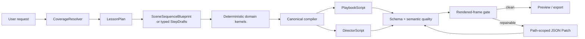

# MetaView Agent Harness V2

This document records the production hardening contract for MetaView's model-backed generation path.

## Why the harness changed

The legacy sidecar asked a model to drive a long, mutable Drawing CLI transaction while capability restrictions, step-count rules, template lifecycle, retry ownership, and final validation were split across prompts, TypeScript, and Python. A model could follow the written instructions and still fail because the executable tool protocol contradicted them. Repair then regenerated the whole Playbook, so successful content could regress.

Harness V2 makes the execution boundary explicit:



## Runtime invariants

1. The API owns the request-scoped capability decision and sends an explicit tool manifest to the sidecar.
2. The sidecar registers only authorized runtime tools plus harness-internal authoring tools.
3. One `/generate` request performs one model attempt. The sidecar does not hide retries.
4. `plan_outline` creates exactly 8–14 ordered slots in a supported domain.
5. Templates create editable drafts; they never silently commit.
6. Step indexes are unique, contiguous, and tied to the outline.
7. `finalize_playbook` rejects open or unresolved drafts. It never auto-commits.
8. Animation registry output is attached directly to a draft and is not re-authored by the model.
9. Code lessons use a real `code_highlight`/code-trace contract.
10. Canonical schema and semantic checks remain backend-owned.
11. Repair exposes only `apply_playbook_patch`; generation tools are unavailable in repair mode.
12. Immutable fields (`fps`, `total_frames`, `step_id`, `end_frame`, primary timing) remain compiler-owned.

## SceneSequenceBlueprint

`SceneSequenceBlueprint` adds ordered `checkpoints` to the existing declarative scene contract. A checkpoint declares semantic state changes, narration goals, transitions, and assertions. It does not contain Remotion code, pixel coordinates, or final frame numbers.

Reference cases:

- derivative/tangent: curve, target point, secant approach, tangent;
- recursion stack: push, base case, return unwind, Code Sync;
- projectile motion: changing position, velocity components, and gravity.

The compiler returns source-map metadata from checkpoint IDs to Playbook step paths so quality issues can be repaired at the highest stable layer.

## Repair protocol

API review prompts still contain `previous_playbook` and `blocking_issues`. The sidecar recognizes this structured payload and switches to repair mode:

```text
previous Playbook
  -> derive allowed paths from issue paths
  -> model proposes RFC 6902 add/remove/replace operations
  -> apply in isolation
  -> recompute timeline and primary-layer mirror
  -> canonical validation
```

The patch tool rejects unrelated paths and immutable derived fields. The API remains the owner of the shared repair budget and acceptance decision.

## Observability

Every Agent attempt now emits bounded, redacted tool and runtime events containing:

- sequence and attempt ID;
- tool name and success/failure;
- redacted argument summary;
- emitter state before and after;
- typed error details;
- latency;
- route and effective tool inventory;
- compile, preflight, rendered-quality, repair, and terminal events.

A compact trace summary is retained in `PlaybookScript.initial_data`; the full trace is returned through `AgentResult`.

## Rendered quality gate

Set `AGENT_RENDERED_QUALITY_GATE=true` to run representative frames through the existing Remotion shot renderer before sidecar success. The first implementation checks:

- content occupancy;
- edge clipping risk;
- exact duplicate frames;
- consecutive pixel delta and missing scene progression.

The gate is opt-in during rollout. Existing deterministic visual suites remain the reference for threshold calibration.

## Rollout

1. Keep `METAVIEW_GENERATION_MODE=single` as the rollback path until Agent parity evidence is recorded.
2. Enable Agent mode for the derivative, recursion, and projectile reference matrix first.
3. Record model calls, tool calls, latency, repairs, first-preview success, and rendered-quality failures.
4. Enable the strict rendered gate after thresholds are calibrated against Gold Templates.
5. Do not widen subject coverage until the reference matrix meets the acceptance targets in issue #160.
